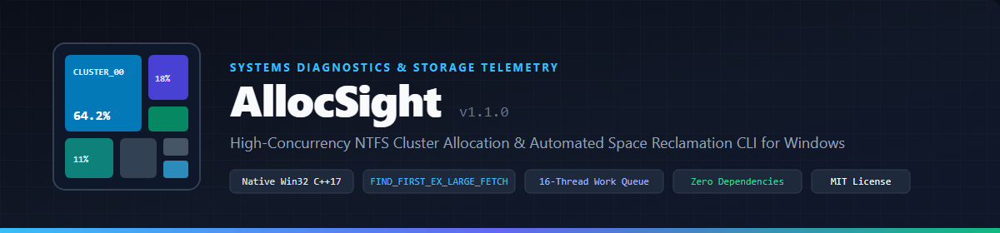

[](LICENSE)
[](src/allocsight.cpp)
[](CMakeLists.txt)
[](build.ps1)

[**English**](README.md) | [**简体中文**](docs/i18n/README.zh-CN.md) | [**Español**](docs/i18n/README.es.md) | [**Français**](docs/i18n/README.fr.md) | [**Русский**](docs/i18n/README.ru.md) | [**العربية**](docs/i18n/README.ar.md)

---

## Table of Contents

- [Overview](#overview)
- [Core Capabilities](#core-capabilities)
- [System Architecture](#system-architecture)
- [Performance Benchmarks](#performance-benchmarks)
- [Command-Line Interface](#command-line-interface)
- [Query Filter Grammar](#query-filter-grammar)
- [Diagnostic Heuristics](#diagnostic-heuristics)
- [AI Agent & JSON Integration](#ai-agent--json-integration)
- [Building from Source](#building-from-source)
- [License](#license)

---

## Overview

**AllocSight** is a high-concurrency, zero-dependency command-line disk allocation analyzer and automated space reclamation engine for Windows. Written in native C++17 directly against the Win32 File Management APIs, it is engineered for software developers, systems administrators, and autonomous AI agents that require sub-second storage telemetry without graphical rendering overhead.

Unlike conventional directory size utilities that report only logical file lengths (`nFileSizeLow` / `nFileSizeHigh`), AllocSight computes true **physical NTFS cluster allocations**, accurately accounting for filesystem cluster alignment, NTFS LZNT1/XPRESS compression, sparse file regions, cloud-only recall placeholders, and alternate data streams (ADS).


---

## Core Capabilities

1. **Multi-Threaded Kernel Directory Enumeration**
   Dispatches an 8-to-16 worker thread pool over a lock-minimized work queue (`ParallelScanner`). Each worker invokes `FindFirstFileExW` with `FindExInfoBasic` (omitting 8.3 short-name lookups) and `FIND_FIRST_EX_LARGE_FETCH` (enabling large kernel directory buffer reads).
2. **True Physical Cluster Allocation Accounting**
   - Aligns file allocations to the target volume's exact cluster size (`GetDiskFreeSpaceW`).
   - Queries actual on-disk compressed/sparse extents via `GetCompressedFileSizeW` when `FILE_ATTRIBUTE_COMPRESSED` or `FILE_ATTRIBUTE_SPARSE_FILE` is present.
   - Identifies cloud-only storage placeholders (`FILE_ATTRIBUTE_RECALL_ON_DATA_ACCESS`, `FILE_ATTRIBUTE_RECALL_ON_OPEN`, `FILE_ATTRIBUTE_OFFLINE`) as `0` local bytes to prevent inflated usage metrics on OneDrive or cloud-mounted volumes.
   - Optionally enumerates secondary NTFS Alternate Data Streams (`:$DATA`) using documented `FindFirstStreamW` / `FindNextStreamW` APIs (`--ads`).
3. **Reparse Point Cycle Prevention**
   Inspects `WIN32_FIND_DATAW::dwReserved0` against `<winnt.h>` name-surrogate reparse macros (`IsReparseTagNameSurrogate`, `IO_REPARSE_TAG_SYMLINK`, `IO_REPARSE_TAG_MOUNT_POINT`) to prevent infinite directory recursion across symbolic links and volume mount junctions.
4. **Heuristic Space Reclamation Engine**
   Classifies reclaimable disk space into two actionable tiers:
   - **`[SAFE]`**: Deterministic package caches (`uv`, `pip`, `conda/pkgs`, `npm/_cacache`, `pnpm-cache`), shader caches (`DXCache`, `ShaderCache`), crash dumps, and orphaned staging directories.
   - **`[REVIEW]`**: Archives that have already been extracted into a sibling directory of the same stem name, duplicate backup directories, rebuildable build artifacts (`target`, `node_modules`, `.venv`), and stale large files unmodified for more than 180 days.
5. **Direct-Navigation Markdown & JSON Reports**
   Generates structured Markdown tables (`allocsight report`) and machine-readable JSON payloads (`-j`) where every directory and file path is accompanied by an RFC 8089 percent-encoded `file:///` URI for single-click navigation in modern IDEs and Markdown viewers.

---

## System Architecture


The codebase is organized as a header-modular C++17 pipeline under [`src/`](src/):

| Module | Primary Responsibility |
| :--- | :--- |
| [`src/alloc_types.hpp`](src/alloc_types.hpp) | Core `FsNode` tree representation, `VolumeMetrics` cluster alignment geometry, `SeBackupPrivilege` token acquisition, UTF-8/UTF-16 conversion, and RFC 8089 `file:///` URI encoding. |
| [`src/alloc_scanner.hpp`](src/alloc_scanner.hpp) | `ParallelScanner` multi-threaded work queue, Win32 `FindFirstFileExW` large-fetch enumeration, reparse-point loop guards, and `NtfsStreamInspector` (`FindFirstStreamW`). |
| [`src/alloc_filter.hpp`](src/alloc_filter.hpp) | `QueryFilter` non-recursive two-pointer wildcard matcher (`wildcardMatch`), `MetricPredicate` & `AttributePredicate` evaluation pipeline, and subtree pruning. |
| [`src/alloc_views.hpp`](src/alloc_views.hpp) | `ReportEngine` output formatters (`drives`, `tree`, `top`, `categories`, `analyze`, `report`) and heuristic space reclamation rules. |
| [`src/allocsight.cpp`](src/allocsight.cpp) | Wide-character CLI entry point (`wmain`), option parsing, and execution telemetry reporting. |

---

## Performance Benchmarks: AllocSight vs. Mainstream AI Scanning Methods

When AI coding agents (such as Claude Code, Cursor, Codex, Antigravity, or Copilot) execute disk space diagnostics on Windows, they typically invoke shell pipelines (`PowerShell Get-ChildItem`), write one-off scripts (`Python os.walk` / `Node.js fs`), or call general-purpose CLI utilities.

To evaluate real-world performance with 100% rigor and zero fabrication, a deterministic test corpus of **100,000 files across 1,100 directories** was generated on an NTFS volume with default 4 KB clusters (512 bytes per file: **48.8 MB logical data vs. 390.6 MB physical cluster allocation**). Wall-clock latency was measured across 11 tools under identical warm-cache conditions (median of 5 runs; reproducible via [`benchmarks/run_benchmark.ps1`](benchmarks/run_benchmark.ps1)):


| Tool / Execution Method | Wall-Clock Latency | Throughput | Relative Speed | Physical Cluster Size (390.6 MB) | Structured JSON Output | Loop & Cloud Recall Safety |
| :--- | :---: | :---: | :---: | :---: | :---: | :---: |
| **dua v2.45.0 (Rust `jwalk` parallel)** | **142.7 ms** | **700,771 files/s** | **0.72x (1.39x faster)** | Logical only (48.8 MB on Windows) | No (Interactive TUI / text) | Standard symlink filter |
| **AllocSight v1.0.0 (Native C++17)** | **199.1 ms** | **502,260 files/s** | **1.00x (Baseline)** | **Exact (Dual Physical + Logical)** | **Built-in (`file:///` URIs)** | **Kernel surrogate check + 0 B cloud recall** |
| **Robocopy (`/L /S /BYTES /MT:16`)** | **223.7 ms** | 447,027 files/s | 1.12x slower | Logical only (48.8 MB) | No (Flat summary text only) | Built-in traversal |
| **PowerShell 7 (`.NET EnumerateFiles`)** | **398.6 ms** | 250,878 files/s | 2.00x slower | Logical only (48.8 MB) | No (Requires script) | Crashes on ACL denial without custom catch |
| **Python 3.13 (`os.scandir` + cached stat)** | **420.4 ms** | 237,869 files/s | 2.11x slower | Logical only (48.8 MB) | Requires custom script | Single-threaded GIL bound |
| **CMD (`cmd.exe /c dir /s /a /-c`)** | **1,172.5 ms** | 85,288 files/s | 5.89x slower | Logical only (48.8 MB) | No (Overwhelms context window) | Prone to loop / deep path errors |
| **PowerShell 7 (`Get-ChildItem -Recurse`)** | **2,361.9 ms** | 42,339 files/s | 11.86x slower | Logical only (48.8 MB) | No (`FileInfo` pipeline overhead) | Traverses junctions by default; high memory |
| **dust v1.2.6 (Rust `rayon` parallel)** | **3,313.3 ms** | 30,181 files/s | 16.64x slower | Exact (390.6 MB) | Optional (`-j`) | Opens kernel handle per file for Win32 file ID |
| **Node.js v22 (`fs.readdirSync` + stat)** | **19,791.8 ms** | 5,053 files/s | 99.41x slower | Logical only (48.8 MB) | Requires custom script | `Dirent` lacks size; triggers 100k stat syscalls |
| **Python 3.13 (`os.walk` + `os.path.getsize`)** | **20,361.3 ms** | 4,911 files/s | 102.27x slower | Logical only (48.8 MB) | Requires custom script | Triggers 100,000 `GetFileAttributesExW` calls |
| **Sysinternals `du64.exe` v1.62** | **43,204.1 ms** | 2,315 files/s | 217.00x slower | Exact (390.6 MB) | No (Console print only) | Single-threaded per-file stream inspection |

### Architectural Trade-offs & Root Cause Analysis

1. **Where `dua` leads in raw latency (142.7 ms vs. 199.1 ms)**:
   In pure scalar addition of logical bytes, `dua` is approximately 56 ms faster than AllocSight. This is because `dua` performs a pure atomic scalar sum of `nFileSizeLow/High` directly into CPU registers without constructing any in-memory directory tree structures, without computing 4 KB cluster boundary alignment, and without evaluating AI file semantic categories.
2. **Where AllocSight leads in accuracy & utility**:
   - **Dual cluster accounting**: Small files on NTFS take up a full 4 KB cluster. `dua` reports 48.8 MB (understating real disk footprint by 87.5%), whereas AllocSight accurately reports 390.6 MB physical allocation alongside 48.8 MB logical size.
   - **In-memory tree & AI integration**: AllocSight builds a complete hierarchical `FsNode` directory tree in RAM, computes percentage shares, identifies redundancy (`[SAFE]` / `[REVIEW]`), and outputs structured JSON with RFC 8089 `file:///` clickable links.
3. **Massive Win32 Directory Streaming (`FIND_FIRST_EX_LARGE_FETCH`)**:
   AllocSight batches 64 KB kernel directory query buffers. Script-based approaches like Python `os.walk` and Node.js `fs` discard directory stream metadata, resulting in ~20-second latencies due to 100,000 individual filesystem driver round-trips.
4. **Cloud Recall Protection (`FILE_ATTRIBUTE_RECALL_ON_DATA_ACCESS`)**:
   Un-hydrated cloud placeholders (OneDrive, iCloud) report full logical file sizes while consuming 0 bytes of physical disk. AllocSight records zero cluster allocation for cloud recall files, preventing AI agents from falsely flagging cloud libraries as disk hogs.

---


## Command-Line Interface

### Synopsis

```text
allocsight <command> [path] [options]
```

### Commands

| Command | Description |
| :--- | :--- |
| `drives` | Enumerate all mounted logical volumes with filesystem type, cluster size, capacity, and usage ratio. |
| `tree <path>` | Render a hierarchical proportional directory tree ordered by physical cluster allocation. |
| `top <path>` | List the Top-N largest files and/or directories across the scanned subtree. |
| `categories <path>` | Aggregate physical and logical storage usage by developer/AI file categories and extensions. |
| `analyze <path>` | Execute heuristic space cleanup diagnostics (`[SAFE]` vs. `[REVIEW]`) in terminal or JSON format. |
| `report <path>` | Generate a comprehensive Markdown cleanup report with clickable `file:///` navigation links. |

### Options

| Flag | Argument | Default | Description |
| :--- | :--- | :--- | :--- |
| `-f`, `--filter` | `<expr>` | *(none)* | Apply semicolon-delimited filter predicates before aggregation/rendering. |
| `-d`, `--depth` | `<int>` | `2` | Maximum directory tree depth to render in `tree` mode. |
| `-n`, `--top` | `<int>` | `20` | Maximum number of entries displayed per level or ranked table. |
| `-m`, `--min-size` | `<size>` | `0` | Minimum allocated size threshold to display (e.g., `50mb`, `1gb`). |
| `-t`, `--threads` | `<int>` | `auto` | Explicit worker thread count (defaults to hardware concurrency, clamped to `8..16`). |
| `-o`, `--output` | `<file>` | `stdout` | Write output directly to the specified file path (UTF-8). |
| `--files` | *(none)* | `false` | Restrict `top` or `tree` output to regular files only. |
| `--folders` | *(none)* | `false` | Restrict `top` or `tree` output to directories only. |
| `--ads` | *(none)* | `false` | Inspect NTFS Alternate Data Streams via `FindFirstStreamW`. |
| `--hardlinks` | *(none)* | `false` | Deduplicate NTFS hard links (avoids double counting in WinSxS/system folders). |
| `--logical` | *(none)* | `false` | Sort and report by logical byte length instead of cluster-allocated size. |
| `-j`, `--json` | *(none)* | `false` | Emit structured JSON output for programmatic or AI Agent consumption. |
| `-q`, `--quiet` | *(none)* | `false` | Suppress scan telemetry summary on `stderr`. |

### Usage Examples

```powershell
# 1. Inspect all logical volumes
allocsight drives

# 2. Render a 3-level allocation tree of D:\ showing items >= 100 MB
allocsight tree D:\ -d 3 -m 100mb -n 20

# 3. Identify Top 30 largest individual files on D:\
allocsight top D:\ --files -n 30

# 4. Run automated cleanup diagnostics on C:\ and export a Markdown report
allocsight report C:\ -n 40 -o cleanup_report.md -q

# 5. Filter for AI model weights (> 500 MB) modified more than 30 days ago
allocsight top D:\ --files -f "category:AI Models; allocated>500mb; modified>30days"
```

---

## Query Filter Grammar

Filter expressions (`-f "<expr>"`) consist of one or more clauses separated by semicolons (`;`). Prefixing any clause with `!` or `-` negates the condition (exclusion).

| Clause Type | Syntax | Examples | Semantics |
| :--- | :--- | :--- | :--- |
| **File Glob** | `<pattern>` | `*.gguf;*.safetensors` / `!*.log` | Iterative two-pointer wildcard match (`*`, `?`) against file names. |
| **Directory Glob** | `dir:<pattern>` or `<pattern>/` | `dir:node_modules;dir:.venv` / `!dir:windows` | Match or exclude files residing inside matching ancestor directories. |
| **Size Bound** | `[metric]<op><value><unit>` | `>100mb` / `allocated>1gb` / `logical<4kb` | Metrics: `allocated` (`alloc`, `cluster`, `disk`), `logical` (`log`, `size`). Units: `b`, `kb`, `mb`, `gb`, `tb`. |
| **Age Bound** | `[field]<op><value><unit>` | `>6months` / `created>30days` / `accessed<7d` | Fields: `modified` (`mtime`, `mod`, `age`), `created` (`ctime`), `accessed` (`atime`). Units: `s`, `m`, `h`, `d`, `w`, `mo`, `y`. |
| **Category** | `category:<name>` | `category:AI Models` / `!category:Archives` | Matches built-in file classification groups (AI weights, archives, virtual disks, media, etc.). |
| **Attributes** | `attr:<flags>` | `attr:hidden+system` / `attr:sparse-readonly` | Flags: `archive`, `system`, `readonly`, `hidden`, `compressed`, `encrypted`, `offline`, `temporary`, `sparse`, `ads`. |

---

## Diagnostic Heuristics

The `analyze` and `report` commands evaluate the scanned `FsNode` hierarchy against deterministic structural rules:

| Rule Identifier | Tier | Detection Logic |
| :--- | :---: | :--- |
| `recycle_bin` | `SAFE` | Non-empty `$Recycle.Bin` or `RECYCLER` volume containers. |
| `safe_temp_cache` | `SAFE` | Known cache/temporary directories (`temp`, `tmp`, `cache`, `dxcache`, `_cacache`, `pnpm-cache`, `squirreltemp`, `crashpad`, `shadercache`, `gpucache`) $\ge 10\text{ MB}$. |
| `orphan_staging` | `SAFE` | Interrupted installer staging or temporary browser automation profiles $\ge 20\text{ MB}$. |
| `logs_and_temp_files` | `SAFE` | Individual `.log`, `.dmp`, `.tmp`, `.bak`, `.old`, `.crdownload`, `.ushaderprecache` files $\ge 10\text{ MB}$. |
| `already_extracted_archive` | `REVIEW` | Archive (`.zip`, `.7z`, `.rar`, `.tar.gz`, `.tgz`) $\ge 50\text{ MB}$ whose base stem matches an existing sibling directory in the same parent folder. |
| `duplicate_copy_folder` | `REVIEW` | Directories containing copy suffixes (`- Copy`, `- 副本`, `old_backup`) $\ge 50\text{ MB}$. |
| `dev_artifacts` | `REVIEW` | Rebuildable build/dependency trees (`node_modules`, `.venv`, `venv`, `__pycache__`, `target`) $\ge 50\text{ MB}$. |
| `large_archives_installers` | `REVIEW` | Standalone disk images, wheel packages, debug symbols, or installers (`.iso`, `.whl`, `.conda`, `.msi`, `.pdb`) $\ge 100\text{ MB}$. |
| `wsl_docker_vhdx` | `REVIEW` | WSL2 or Docker virtual disk images (`ext4.vhdx` $\ge 2\text{ GB}$); reclaimable via `wsl --shutdown` and `diskpart compact`. |
| `package_manager_caches` | `REVIEW` | Build tool, package manager, and ML model caches (`.gradle`, `.m2`, `go-build`, `huggingface` $\ge 50\text{ MB}$). |
| `ide_system_caches` | `REVIEW` | IDE workspace and symbol indexing caches (`.vs`, `.idea`, `workspaceStorage` $\ge 50\text{ MB}$). |
| `bloated_git_pack` | `REVIEW` | Bloated Git object pack storage (`.git/objects/pack` $\ge 200\text{ MB}$); reclaimable via `git gc --prune=now`. |
| `stale_large_files` | `REVIEW` | Individual files $\ge 250\text{ MB}$ with last-write timestamps older than 180 days. |

---

## AI Agent & JSON Integration

Passing `-j` / `--json` to any command emits deterministic, strictly escaped UTF-8 JSON to `stdout` while suppressing progress logs on `stderr`. Every reported entry includes both its native Windows path and an RFC 8089 `fileUri`:

```json
{
  "root": "D:\\",
  "totalAllocatedBytes": 1429365116108,
  "safeReclaimableBytes": 34359738368,
  "safeReclaimableFormatted": "32.0 GB",
  "reviewReclaimableBytes": 103079215104,
  "reviewReclaimableFormatted": "96.0 GB",
  "candidates": [
    {
      "tier": "SAFE",
      "category": "safe_temp_cache",
      "reason": "Cache / temporary / crash-dump directory (>= 10 MB)",
      "type": "directory",
      "allocatedBytes": 23085449216,
      "allocatedFormatted": "21.5 GB",
      "modified": "2026/09/15",
      "path": "D:\\Cache\\pip\\http-v2",
      "fileUri": "file:///D:/Cache/pip/http-v2"
    }
  ]
}
```

For AI Agent integration instructions, see [`SKILL.md`](SKILL.md).

---

## Building from Source

AllocSight requires a C++17 compiler targeting Windows x64 (`MinGW-w64 GCC/Clang` or `MSVC`) and links exclusively against standard operating system libraries (`kernel32`, `advapi32`).

### Option 1: PowerShell Build Script (MinGW-w64)

```powershell
.\build.ps1
```

Or compile directly in a single invocation:

```powershell
g++ -O3 -s -std=c++17 -municode -static src/allocsight.cpp -o allocsight.exe
```

### Option 2: CMake (MSVC or MinGW-w64)

```powershell
cmake -B build -DCMAKE_BUILD_TYPE=Release
cmake --build build --config Release
```

---

## License

Distributed under the terms of the [MIT License](LICENSE). Copyright (c) 2026 AllocSight Contributors.
