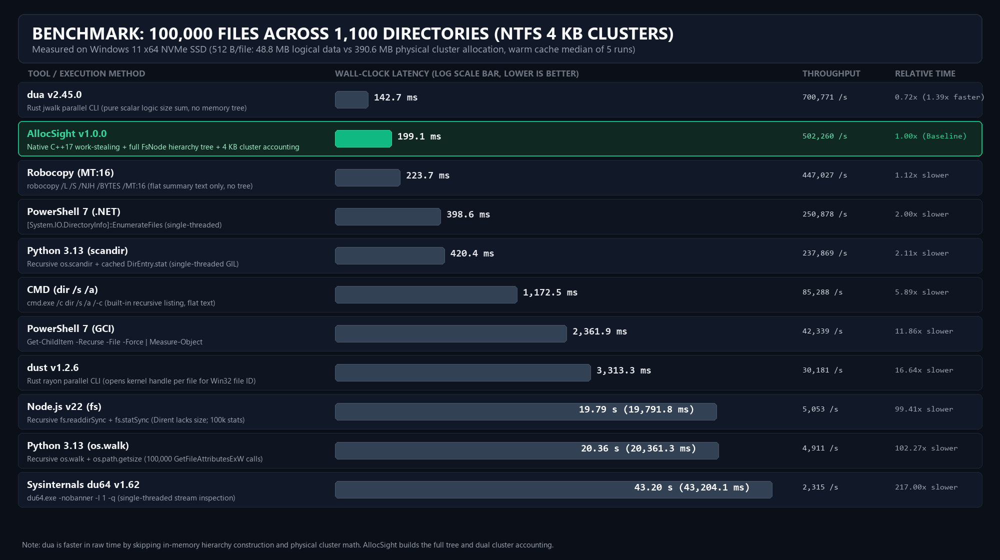

[](../../LICENSE)
[](../../src/allocsight.cpp)
[](../../CMakeLists.txt)
[](../../build.ps1)

[**English**](../../README.md) | [**简体中文**](README.zh-CN.md) | [**Español**](README.es.md) | [**Français**](README.fr.md) | [**Русский**](README.ru.md) | [**العربية**](README.ar.md)

---

## Tabla de Contenidos

- [Descripción General](#descripción-general)
- [Capacidades Técnicas Clave](#capacidades-técnicas-clave)
- [Arquitectura del Sistema](#arquitectura-del-sistema)
- [Pruebas de Rendimiento](#pruebas-de-rendimiento)
- [Referencia de Línea de Comandos](#referencia-de-línea-de-comandos)
- [Gramática de Filtros de Consulta](#gramática-de-filtros-de-consulta)
- [Heurística de Diagnóstico de Espacio](#heurística-de-diagnóstico-de-espacio)
- [Integración con Agentes de IA y JSON](#integración-con-agentes-de-ia-y-json)
- [Compilación desde el Código Fuente](#compilación-desde-el-código-fuente)
- [Licencia](#licencia)

---

## Descripción General

**AllocSight** es un analizador de asignación de clústeres de disco de alta concurrencia y un motor automatizado de recuperación de espacio en línea de comandos para Windows, sin dependencias externas. Escrito en C++17 nativo directamente sobre las API de gestión de archivos de Win32, está diseñado para desarrolladores de software, administradores de sistemas y agentes autónomos de IA que requieren telemetría de almacenamiento en fracciones de segundo sin la sobrecarga del renderizado gráfico.

A diferencia de las utilidades convencionales que solo informan longitudes lógicas de archivo (`nFileSizeLow` / `nFileSizeHigh`), AllocSight calcula las **asignaciones físicas reales de clústeres NTFS**, contabilizando con precisión la alineación de clústeres del sistema de archivos, la compresión transparente NTFS (LZNT1/XPRESS), las regiones de archivos dispersos (sparse files), los marcadores de posición en la nube y los flujos de datos alternativos (ADS).


---

## Capacidades Técnicas Clave

1. **Enumeración de Directorios del Kernel Multihilo**
   Despliega un grupo de 8 a 16 hilos de trabajo sobre una cola sincronizada de baja contención (`ParallelScanner`). Cada hilo invoca `FindFirstFileExW` con `FindExInfoBasic` (omitiendo la búsqueda de nombres cortos 8.3) y `FIND_FIRST_EX_LARGE_FETCH` (habilitando lecturas de búfer de directorio grandes en el kernel).
2. **Contabilidad Exacta de Clústeres Físicos NTFS**
   - Alinea las asignaciones de archivos al tamaño exacto de clúster del volumen de destino (`GetDiskFreeSpaceW`).
   - Consulta la asignación física comprimida o dispersa mediante `GetCompressedFileSizeW` cuando están presentes `FILE_ATTRIBUTE_COMPRESSED` o `FILE_ATTRIBUTE_SPARSE_FILE`.
   - Identifica archivos residentes únicamente en la nube (`FILE_ATTRIBUTE_RECALL_ON_DATA_ACCESS`, `FILE_ATTRIBUTE_RECALL_ON_OPEN`, `FILE_ATTRIBUTE_OFFLINE`) con `0` bytes físicos locales.
   - Enumera opcionalmente flujos de datos alternativos NTFS (`:$DATA`) mediante las API documentadas `FindFirstStreamW` / `FindNextStreamW` (`--ads`).
3. **Prevención de Ciclos en Puntos de Reanálisis (Reparse Points)**
   Evalúa `WIN32_FIND_DATAW::dwReserved0` utilizando las macros estándar de `<winnt.h>` (`IsReparseTagNameSurrogate`, `IO_REPARSE_TAG_SYMLINK`, `IO_REPARSE_TAG_MOUNT_POINT`) para evitar bucles infinitos causados por enlaces simbólicos y puntos de montaje de volumen.
4. **Motor Heurístico de Recuperación de Espacio**
   Clasifica el espacio recuperable en dos niveles operativos:
   - **`[SAFE]`**: Cachés deterministas de gestores de paquetes (`uv`, `pip`, `conda/pkgs`, `npm/_cacache`, `pnpm-cache`), cachés de sombreadores (`DXCache`, `ShaderCache`), volcados de memoria y directorios temporales huérfanos.
   - **`[REVIEW]`**: Archivos comprimidos que ya han sido extraídos en una carpeta contigua con el mismo nombre base, carpetas de copia duplicadas, artefactos de compilación reconstruibles (`target`, `node_modules`, `.venv`) y archivos grandes sin modificar durante más de 180 días.
5. **Informes Markdown y JSON con Navegación Directa**
   Genera tablas Markdown estructuradas (`allocsight report`) y salidas JSON (`-j`) donde cada ruta incluye un URI `file:///` codificado según RFC 8089 para abrir carpetas o archivos con un solo clic.

---

## Arquitectura del Sistema


El código fuente está organizado como una tubería modular de cabeceras C++17 dentro de [`src/`](../../src/):

| Módulo | Responsabilidad Principal |
| :--- | :--- |
| [`src/alloc_types.hpp`](../../src/alloc_types.hpp) | Árbol de nodos `FsNode`, geometría de alineación de clústeres `VolumeMetrics`, adquisición del privilegio `SeBackupPrivilege`, conversión UTF-8/UTF-16 y codificación de URI `file:///`. |
| [`src/alloc_scanner.hpp`](../../src/alloc_scanner.hpp) | Cola de trabajo multihilo `ParallelScanner`, enumeración `FindFirstFileExW` de gran búfer, protección contra bucles de enlaces simbólicos e inspector `NtfsStreamInspector`. |
| [`src/alloc_filter.hpp`](../../src/alloc_filter.hpp) | Motor `QueryFilter` con algoritmo iterativo de dos punteros (`wildcardMatch`), evaluación de vectores `MetricPredicate` y `AttributePredicate`, y poda de subárboles. |
| [`src/alloc_views.hpp`](../../src/alloc_views.hpp) | Formateadores de salida `ReportEngine` (`drives`, `tree`, `top`, `categories`, `analyze`, `report`) y reglas heurísticas de diagnóstico. |
| [`src/allocsight.cpp`](../../src/allocsight.cpp) | Punto de entrada CLI Unicode (`wmain`), análisis de argumentos y resumen de telemetría. |

---

## Pruebas de Rendimiento: Comparativa con Métodos Actuales de Escaneo por IA

En una prueba determinista sobre un volumen NTFS con clústeres de 4 KB que contiene **100.000 archivos distribuidos en 1.100 directorios** (512 bytes por archivo: **48,8 MB lógicos frente a 390,6 MB de ocupación física real**), se midió la latencia de 11 herramientas en Windows (mediana de 5 ejecuciones con caché caliente; reproducible mediante [`benchmarks/run_benchmark.ps1`](../../benchmarks/run_benchmark.ps1)):



| Herramienta / Método | Latencia Medida | Rendimiento | Velocidad Relativa | Asignación Física (390,6 MB) | Salida JSON Estructurada | Seguridad contra Bucles y Cloud |
| :--- | :---: | :---: | :---: | :---: | :---: | :---: |
| **dua v2.45.0 (Rust `jwalk` paralelo)** | **142,7 ms** | **700.771 archivos/s** | **0,72x (1,39x más rápido)** | Solo lógica (48,8 MB en Windows) | No (TUI interactivo / texto) | Filtro estándar de enlaces |
| **AllocSight v1.0.0 (C++17 Nativo)** | **199,1 ms** | **502.260 archivos/s** | **1,00x (Base)** | **Exacta (Física + Lógica)** | **Nativa (`file:///` URIs)** | **Protección por kernel + Cloud Recall 0 B** |
| **Robocopy (`/L /S /BYTES /MT:16`)** | **223,7 ms** | 447.027 archivos/s | 1,12x más lento | Solo lógica (48,8 MB) | No (Solo resumen plano) | Recorrido estándar integrado |
| **PowerShell 7 (`.NET EnumerateFiles`)** | **398,6 ms** | 250.878 archivos/s | 2,00x más lento | Solo lógica (48,8 MB) | No (Requiere script) | Falla ante denegación de permisos sin catch |
| **Python 3.13 (`os.scandir` + stat en caché)** | **420,4 ms** | 237.869 archivos/s | 2,11x más lento | Solo lógica (48,8 MB) | Requiere script | Monohilo limitado por GIL |
| **CMD (`cmd.exe /c dir /s /a /-c`)** | **1.172,5 ms** | 85.288 archivos/s | 5,89x más lento | Solo lógica (48,8 MB) | No (Desborda contexto de IA) | Inseguro ante rutas profundas |
| **PowerShell 7 (`Get-ChildItem -Recurse`)** | **2.361,9 ms** | 42.339 archivos/s | 11,86x más lento | Solo lógica (48,8 MB) | No (Sobrecarga de `FileInfo`) | Sigue junctions por defecto; bucles |
| **dust v1.2.6 (Rust `rayon` paralelo)** | **3.313,3 ms** | 30.181 archivos/s | 16,64x más lento | Exacta (390,6 MB) | Opcional (`-j`) | Abre identificador kernel por archivo en Win32 |
| **Node.js v22 (`fs.readdirSync` + stat)** | **19.791,8 ms** | 5.053 archivos/s | 99,41x más lento | Solo lógica (48,8 MB) | Requiere script | `Dirent` carece de tamaño; 100k llamadas stat |
| **Python 3.13 (`os.walk` + `os.path.getsize`)** | **20.361,3 ms** | 4.911 archivos/s | 102,27x más lento | Solo lógica (48,8 MB) | Requiere script | 100.000 llamadas `GetFileAttributesExW` |
| **Sysinternals `du64.exe` v1.62** | **43.204,1 ms** | 2.315 archivos/s | 217,00x más lento | Exacta (390,6 MB) | No (Solo texto de consola) | Inspección de flujos monohilo por archivo |

---


## Referencia de Línea de Comandos

### Sinopsis

```text
allocsight <comando> [ruta] [opciones]
```

### Comandos

| Comando | Descripción |
| :--- | :--- |
| `drives` | Enumera todos los volúmenes lógicos montados con tipo de sistema de archivos, tamaño de clúster, capacidad y porcentaje de uso. |
| `tree <ruta>` | Muestra un árbol jerárquico proporcional ordenado por asignación física de clústeres. |
| `top <ruta>` | Lista los Top-N archivos y/o directorios más grandes dentro del subárbol escaneado. |
| `categories <ruta>` | Desglosa el uso físico y lógico por categorías de desarrollo/IA y extensiones de archivo. |
| `analyze <ruta>` | Ejecuta el diagnóstico heurístico de limpieza (`[SAFE]` vs. `[REVIEW]`) en consola o JSON. |
| `report <ruta>` | Genera un informe Markdown completo con enlaces `file:///` clicables. |

### Opciones

| Opción | Argumento | Por Defecto | Descripción |
| :--- | :--- | :--- | :--- |
| `-f`, `--filter` | `<expr>` | *(ninguno)* | Aplica predicados de filtrado separados por punto y coma antes de agregar resultados. |
| `-d`, `--depth` | `<int>` | `2` | Profundidad máxima del árbol de directorios en el modo `tree`. |
| `-n`, `--top` | `<int>` | `20` | Número máximo de elementos mostrados por nivel o tabla. |
| `-m`, `--min-size` | `<size>` | `0` | Tamaño físico mínimo para mostrar un elemento (ej. `50mb`, `1gb`). |
| `-t`, `--threads` | `<int>` | `auto` | Número de hilos de trabajo (por defecto: concurrencia de hardware entre `8..16`). |
| `-o`, `--output` | `<file>` | `stdout` | Escribe la salida directamente en el archivo especificado (UTF-8). |
| `--files` | *(ninguno)* | `false` | Limita la salida de `top` o `tree` únicamente a archivos regulares. |
| `--folders` | *(ninguno)* | `false` | Limita la salida de `top` o `tree` únicamente a directorios. |
| `--ads` | *(ninguno)* | `false` | Inspecciona flujos de datos alternativos NTFS mediante `FindFirstStreamW`. |
| `--logical` | *(ninguno)* | `false` | Ordena y muestra tamaños lógicos en lugar de asignación de clústeres. |
| `-j`, `--json` | *(ninguno)* | `false` | Emite salida en formato JSON estructurado para scripts o agentes de IA. |
| `-q`, `--quiet` | *(ninguno)* | `false` | Suprime el resumen de telemetría de escaneo en `stderr`. |

---

## Gramática de Filtros de Consulta

Las expresiones de filtro (`-f "<expr>"`) constan de una o más cláusulas separadas por punto y coma (`;`). Anteponga `!` o `-` a cualquier cláusula para excluir coincidencias.

| Tipo de Cláusula | Sintaxis | Ejemplos | Semántica |
| :--- | :--- | :--- | :--- |
| **Patrón de Archivo** | `<patrón>` | `*.gguf;*.safetensors` / `!*.log` | Coincidencia de comodines (`*`, `?`) mediante dos punteros iterativos sobre nombres de archivo. |
| **Patrón de Directorio** | `dir:<patrón>` o `<patrón>/` | `dir:node_modules;dir:.venv` / `!dir:windows` | Incluye o excluye archivos ubicados dentro de directorios ancestros coincidentes. |
| **Límite de Tamaño** | `[métrica]<op><valor><unidad>` | `>100mb` / `allocated>1gb` / `logical<4kb` | Métricas: `allocated` (`alloc`, `cluster`, `disk`), `logical` (`log`, `size`). Unidades: `b`, `kb`, `mb`, `gb`, `tb`. |
| **Límite de Antigüedad** | `[campo]<op><valor><unidad>` | `>6months` / `created>30days` / `accessed<7d` | Campos: `modified` (`mtime`, `mod`, `age`), `created` (`ctime`), `accessed` (`atime`). Unidades: `s`, `m`, `h`, `d`, `w`, `mo`, `y`. |
| **Categoría** | `category:<nombre>` | `category:AI Models` / `!category:Archives` | Filtra por categorías integradas (modelos de IA, archivos comprimidos, discos virtuales, etc.). |
| **Atributos** | `attr:<banderas>` | `attr:hidden+system` / `attr:sparse-readonly` | Banderas: `archive`, `system`, `readonly`, `hidden`, `compressed`, `encrypted`, `offline`, `temporary`, `sparse`, `ads`. |

---

## Heurística de Diagnóstico de Espacio

| Identificador de Regla | Nivel | Lógica de Detección |
| :--- | :---: | :--- |
| `recycle_bin` | `SAFE` | Contenedores `$Recycle.Bin` o `RECYCLER` con contenido no vacío. |
| `safe_temp_cache` | `SAFE` | Directorios de caché/temporales conocidos (`temp`, `tmp`, `cache`, `dxcache`, `_cacache`, `pnpm-cache`, `squirreltemp`, `crashpad`, `shadercache`, `gpucache`) $\ge 10\text{ MB}$. |
| `orphan_staging` | `SAFE` | Directorios temporales de instaladores interrumpidos o perfiles de automatización de navegadores $\ge 20\text{ MB}$. |
| `logs_and_temp_files` | `SAFE` | Archivos individuales `.log`, `.dmp`, `.tmp`, `.bak`, `.old`, `.crdownload`, `.ushaderprecache` $\ge 10\text{ MB}$. |
| `already_extracted_archive` | `REVIEW` | Archivo comprimido (`.zip`, `.7z`, `.rar`, `.tar.gz`, `.tgz`) $\ge 50\text{ MB}$ cuyo nombre base coincide con un directorio contiguo ya extraído. |
| `duplicate_copy_folder` | `REVIEW` | Directorios con sufijos de copia (`- Copy`, `- 副本`, `old_backup`) $\ge 50\text{ MB}$. |
| `dev_artifacts` | `REVIEW` | Directorios de dependencias o compilación reconstruibles (`node_modules`, `.venv`, `venv`, `__pycache__`, `target`) $\ge 50\text{ MB}$. |
| `large_archives_installers` | `REVIEW` | Imágenes de disco, paquetes wheel, símbolos de depuración o instaladores (`.iso`, `.whl`, `.conda`, `.msi`, `.pdb`) $\ge 100\text{ MB}$. |
| `stale_large_files` | `REVIEW` | Archivos individuales $\ge 250\text{ MB}$ sin modificaciones durante más de 180 días. |

---

## Integración con Agentes de IA y JSON

Al pasar `-j` / `--json` a cualquier comando, se emite JSON UTF-8 estrictamente escapado en `stdout` con los campos `path` y `fileUri` para cada elemento. Consulte [`SKILL.md`](../../SKILL.md) para más detalles.

---

## Compilación desde el Código Fuente

### Opción 1: Script PowerShell (MinGW-w64)

```powershell
.\build.ps1
```

O directamente con `g++`:

```powershell
g++ -O3 -s -std=c++17 -municode -static src/allocsight.cpp -o allocsight.exe
```

### Opción 2: CMake (MSVC o MinGW-w64)

```powershell
cmake -B build -DCMAKE_BUILD_TYPE=Release
cmake --build build --config Release
```

---

## Licencia

Distribuido bajo los términos de la [Licencia MIT](../../LICENSE). Copyright (c) 2026 AllocSight Contributors.
