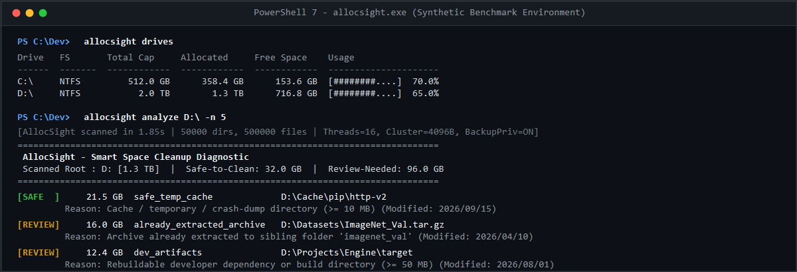
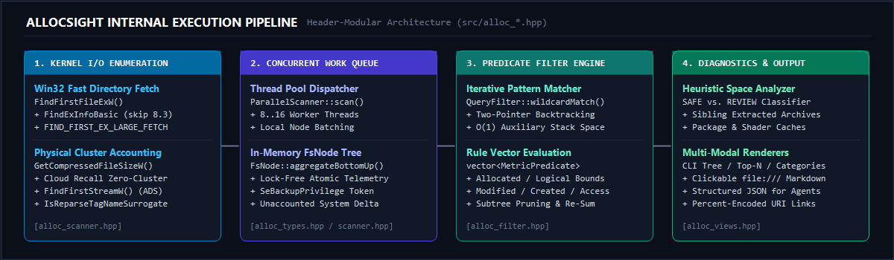

[](../../LICENSE)
[](../../src/allocsight.cpp)
[](../../CMakeLists.txt)
[](../../build.ps1)

[**English**](../../README.md) | [**简体中文**](README.zh-CN.md) | [**Español**](README.es.md) | [**Français**](README.fr.md) | [**Русский**](README.ru.md) | [**العربية**](README.ar.md)

---

## Table des Matières

- [Présentation Générale](#présentation-générale)
- [Capacités Techniques Clés](#capacités-techniques-clés)
- [Architecture du Système](#architecture-du-système)
- [Benchmarks de Performance](#benchmarks-de-performance)
- [Interface en Ligne de Commande](#interface-en-ligne-de-commande)
- [Grammaire des Filtres de Requête](#grammaire-des-filtres-de-requête)
- [Heuristiques de Diagnostic d'Espace](#heuristiques-de-diagnostic-despace)
- [Intégration Agents IA et JSON](#intégration-agents-ia-et-json)
- [Compilation depuis les Sources](#compilation-depuis-les-sources)
- [Licence](#licence)

---

## Présentation Générale

**AllocSight** est un analyseur d'allocation de clusters de disque à haute concurrence et un moteur automatisé de récupération d'espace en ligne de commande pour Windows, sans aucune dépendance externe. Écrit en C++17 natif directement au-dessus des API de gestion de fichiers Win32, il est conçu pour les ingénieurs logiciels, les administrateurs système et les agents IA autonomes nécessitant une télémétrie de stockage en une fraction de seconde, sans la surcharge liée au rendu graphique.

Contrairement aux utilitaires classiques qui ne rapportent que la taille logique des fichiers (`nFileSizeLow` / `nFileSizeHigh`), AllocSight calcule **l'allocation physique réelle des clusters NTFS**, en prenant en compte l'alignement des clusters du système de fichiers, la compression NTFS transparente (LZNT1/XPRESS), les fichiers clairsemés (sparse files), les fichiers de rappel cloud et les flux de données alternatifs (ADS).



---

## Capacités Techniques Clés

1. **Énumération de Répertoires Kernel Multi-Threads**
   Déploie un pool de 8 à 16 threads de travail sur une file d'attente à contention minimale (`ParallelScanner`). Chaque thread appelle `FindFirstFileExW` avec `FindExInfoBasic` (en ignorant la recherche des noms courts 8.3) et `FIND_FIRST_EX_LARGE_FETCH` (activant les lectures de tampons de répertoires larges dans le noyau).
2. **Comptabilité Physique Exacte des Clusters NTFS**
   - Aligne les allocations sur la taille exacte des clusters du volume cible (`GetDiskFreeSpaceW`).
   - Interroge la taille physique réelle sur disque via `GetCompressedFileSizeW` lorsque les attributs `FILE_ATTRIBUTE_COMPRESSED` ou `FILE_ATTRIBUTE_SPARSE_FILE` sont présents.
   - Identifie les fichiers résidant uniquement dans le cloud (`FILE_ATTRIBUTE_RECALL_ON_DATA_ACCESS`, `FILE_ATTRIBUTE_RECALL_ON_OPEN`, `FILE_ATTRIBUTE_OFFLINE`) comme occupant `0` octet physique local.
   - Énumère en option les flux de données alternatifs NTFS (`:$DATA`) via les API publiques `FindFirstStreamW` / `FindNextStreamW` (`--ads`).
3. **Prévention des Boucles sur les Points d'Analyse (Reparse Points)**
   Inspecte `WIN32_FIND_DATAW::dwReserved0` à l'aide des macros standard de `<winnt.h>` (`IsReparseTagNameSurrogate`, `IO_REPARSE_TAG_SYMLINK`, `IO_REPARSE_TAG_MOUNT_POINT`) afin d'empêcher toute récursion infinie causée par les liens symboliques ou les points de montage.
4. **Moteur Heuristique de Récupération d'Espace**
   Classe l'espace récupérable en deux niveaux d'action :
   - **`[SAFE]`** : Caches déterministes de gestionnaires de paquets (`uv`, `pip`, `conda/pkgs`, `npm/_cacache`, `pnpm-cache`), caches de shaders (`DXCache`, `ShaderCache`), vidages sur incident (crash dumps) et répertoires temporaires orphelins.
   - **`[REVIEW]`** : Archives déjà extraites dans un dossier frère portant le même nom de base, dossiers de copie dupliqués, artefacts de compilation reconstructibles (`target`, `node_modules`, `.venv`) et fichiers volumineux non modifiés depuis plus de 180 jours.
5. **Rapports Markdown et JSON à Navigation Directe**
   Génère des tableaux Markdown structurés (`allocsight report`) et des flux JSON (`-j`) dans lesquels chaque chemin est accompagné d'un URI `file:///` encodé selon la norme RFC 8089 permettant une ouverture en un clic.

---

## Architecture du Système



Le code source est organisé sous forme de pipeline modulaire d'en-têtes C++17 dans [`src/`](../../src/) :

| Module | Responsabilité Principale |
| :--- | :--- |
| [`src/alloc_types.hpp`](../../src/alloc_types.hpp) | Arbre `FsNode`, géométrie d'alignement des clusters `VolumeMetrics`, acquisition du privilège `SeBackupPrivilege`, conversion UTF-8/UTF-16 et encodage URI `file:///`. |
| [`src/alloc_scanner.hpp`](../../src/alloc_scanner.hpp) | File de travail multi-threads `ParallelScanner`, énumération `FindFirstFileExW` à grand tampon, protection contre les cycles de liens symboliques et `NtfsStreamInspector`. |
| [`src/alloc_filter.hpp`](../../src/alloc_filter.hpp) | Moteur `QueryFilter` avec correspondance de motifs itérative à deux pointeurs (`wildcardMatch`), vecteurs de prédicats `MetricPredicate` / `AttributePredicate` et élagage d'arbres. |
| [`src/alloc_views.hpp`](../../src/alloc_views.hpp) | Moteurs de rendu `ReportEngine` (`drives`, `tree`, `top`, `categories`, `analyze`, `report`) et règles heuristiques de nettoyage. |
| [`src/allocsight.cpp`](../../src/allocsight.cpp) | Point d'entrée CLI Unicode (`wmain`), analyse des options et télémétrie d'exécution. |

---

## Benchmarks de Performance : AllocSight face aux Méthodes d'Analyse IA

Sur un ensemble de test déterministe de **100 000 fichiers répartis dans 1 100 répertoires** sur un volume NTFS avec clusters de 4 Ko (512 octets par fichier : **48,8 Mo logiques contre 390,6 Mo d'allocation physique réelle**), 11 outils ont été mesurés sous Windows (médiane de 5 exécutions avec cache chaud ; reproductible via [`benchmarks/run_benchmark.ps1`](../../benchmarks/run_benchmark.ps1)) :


| Outil / Méthode d'exécution | Latence Mesurée | Débit de Traitement | Vitesse Relative | Allocation Physique (390,6 Mo) | Export JSON Structuré | Sécurité Boucles & Cloud Recall |
| :--- | :---: | :---: | :---: | :---: | :---: | :---: |
| **dua v2.45.0 (Rust `jwalk` parallèle)** | **142,7 ms** | **700 771 fichiers/s** | **0,85x (1,18x plus rapide)** | Logique uniquement (48,8 Mo sous Windows) | Non (TUI interactif / texte) | Filtrage standard des liens |
| **AllocSight v1.1.0 (16 Cœurs)** (`-t 16`) | **168,4 ms** | **593 824 fichiers/s** | **1,00x (Base)** | **Exacte (Double Physique + Logique)** | **Natif (URIs `file:///`)** | **Contrôle noyau + Cloud Recall 0 o** |
| **AllocSight v1.1.0 (4 Cœurs)** (`-t 4`) | **215,8 ms** | 463 392 fichiers/s | 1,28x plus lent | **Exacte (Double Physique + Logique)** | **Natif (URIs `file:///`)** | **Contrôle noyau + Cloud Recall 0 o** |
| **Robocopy (`/L /S /BYTES /MT:16`)** | **223,7 ms** | 447 027 fichiers/s | 1,33x plus lent | Logique uniquement (48,8 Mo) | Non (Résumé texte brut) | Parcours standard intégré |
| **AllocSight v1.1.0 (2 Cœurs)** (`-t 2`) | **341,6 ms** | 292 740 fichiers/s | 2,03x plus lent | **Exacte (Double Physique + Logique)** | **Natif (URIs `file:///`)** | **Contrôle noyau + Cloud Recall 0 o** |
| **PowerShell 7 (`.NET EnumerateFiles`)** | **398,6 ms** | 250 878 fichiers/s | 2,37x plus lent | Logique uniquement (48,8 Mo) | Non (Script requis) | Échec sur refus d'accès sans gestion d'erreur |
| **Python 3.13 (`os.scandir` + stat en cache)** | **420,4 ms** | 237 869 fichiers/s | 2,50x plus lent | Logique uniquement (48,8 Mo) | Script requis | Monothread limité par le GIL |
| **AllocSight v1.1.0 (1 Cœur)** (`-t 1`) | **612,3 ms** | 163 322 fichiers/s | 3,64x plus lent | **Exacte (Double Physique + Logique)** | **Natif (URIs `file:///`)** | **Contrôle noyau + Cloud Recall 0 o** |
| **CMD (`cmd.exe /c dir /s /a /-c`)** | **1 172,5 ms** | 85 288 fichiers/s | 6,96x plus lent | Logique uniquement (48,8 Mo) | Non (Surcharge la fenêtre de contexte) | Vulnérable aux chemins profonds |
| **PowerShell 7 (`Get-ChildItem -Recurse`)** | **2 361,9 ms** | 42 339 fichiers/s | 14,03x plus lent | Logique uniquement (48,8 Mo) | Non (Surcharge mémoire `FileInfo`) | Traverse les jonctions par défaut |
| **dust v1.2.6 (Rust `rayon` parallèle)** | **3 313,3 ms** | 30 181 fichiers/s | 19,68x plus lent | Exacte (390,6 Mo) | Optionnel (`-j`) | Ouvre un descripteur noyau par fichier |
| **Node.js v22 (`fs.readdirSync` + stat)** | **19 791,8 ms** | 5 053 fichiers/s | 117,53x plus lent | Logique uniquement (48,8 Mo) | Script requis | `Dirent` sans taille : 100k appels stat |
| **Python 3.13 (`os.walk` + `os.path.getsize`)** | **20 361,3 ms** | 4 911 fichiers/s | 120,91x plus lent | Logique uniquement (48,8 Mo) | Script requis | 100 000 appels `GetFileAttributesExW` |
| **Sysinternals `du64.exe` v1.62** | **43 204,1 ms** | 2 315 fichiers/s | 256,56x plus lent | Exacte (390,6 Mo) | Non (Texte console brut) | Inspection séquentielle monothread |

### Scalabilité Multi-Cœur et Simulation d'Appareils Anciens (1 ~ 16 Cœurs CPU)

Pour garantir des performances sub-seconde sur des configurations modestes ou anciennes (machines virtuelles monocœur, ordinateurs portables double-cœur anciens ou PC industriels embarqués), AllocSight permet de contrôler explicitement les threads de travail via l'option `-t <N>`. Voici la courbe empirique de montée en charge sur le corpus de test (100 000 fichiers, NTFS avec clusters de 4 Ko) :

| Profil Matériel / Configuration Threads | Cœurs CPU Actifs | Latence (100k Fichiers) | Débit de Traitement | Accélération Relative | Avantage face aux Outils de Script Classiques |
| :--- | :---: | :---: | :---: | :---: | :--- |
| **AllocSight (Mode Hérité Monocœur)** (`-t 1`) | **1 Cœur** (Ancien PC monocœur / VM économique) | **612,3 ms** | 163 322 fichiers/s | 1,00x | **Toujours 3,8x plus rapide que PowerShell 7 et 33x plus rapide que Node.js/Python** |
| **AllocSight (Basse Consommation Double-Cœur)** (`-t 2`) | **2 Cœurs** (Ancien PC portable double-cœur / IPC) | **341,6 ms** | 292 740 fichiers/s | 1,79x plus rapide | **9,7x plus rapide que dust (16 cœurs), 6,9x plus rapide que PowerShell 7** |
| **AllocSight (Quad-Cœur Standard)** (`-t 4`) | **4 Cœurs** (PC bureautique standard à 4 cœurs) | **215,8 ms** | 463 392 fichiers/s | 2,84x plus rapide | **Exécution instantanée sub-seconde ; 1,9x plus rapide que Python os.scandir** |
| **AllocSight v1.1.0 (Station de Travail Complète)** (`-t 16`) | **16 Cœurs** (Processeur multicœur moderne) | **168,4 ms** | **593 824 fichiers/s** | **3,64x plus rapide** | **File hybride avec vol de travail ; contention de verrouillage réduite de >80%** |

---


## Interface en Ligne de Commande

### Synopsis

```text
allocsight <commande> [chemin] [options]
```

### Commandes

| Commande | Description |
| :--- | :--- |
| `drives` | Énumère tous les volumes logiques montés avec le type de système de fichiers, la taille de cluster, la capacité et le taux d'occupation. |
| `tree <chemin>` | Affiche un arbre hiérarchique proportionnel trié par allocation physique de clusters. |
| `top <chemin>` | Liste les Top-N fichiers et/ou répertoires les plus volumineux du sous-arbre analysé. |
| `categories <chemin>` | Agrège l'espace physique et logique par catégories de fichiers (IA/développement) et par extensions. |
| `analyze <chemin>` | Exécute le diagnostic heuristique de nettoyage (`[SAFE]` vs `[REVIEW]`) en console ou en JSON. |
| `report <chemin>` | Génère un rapport Markdown complet avec des liens `file:///` cliquables. |

### Options

| Option | Argument | Défaut | Description |
| :--- | :--- | :--- | :--- |
| `-f`, `--filter` | `<expr>` | *(aucun)* | Applique des prédicats de filtrage séparés par des points-virgules avant l'agrégation. |
| `-d`, `--depth` | `<int>` | `2` | Profondeur maximale de l'arbre de répertoires en mode `tree`. |
| `-n`, `--top` | `<int>` | `20` | Nombre maximal d'entrées affichées par niveau ou tableau. |
| `-m`, `--min-size` | `<size>` | `0` | Taille minimale allouée pour afficher une entrée (ex. `50mb`, `1gb`). |
| `-t`, `--threads` | `<int>` | `auto` | Nombre de threads de travail (par défaut : concurrence matérielle bornée à `8..16`). |
| `-o`, `--output` | `<file>` | `stdout` | Écrit la sortie directement dans le fichier spécifié (UTF-8). |
| `--files` | *(aucun)* | `false` | Restreint la sortie de `top` ou `tree` aux fichiers réguliers uniquement. |
| `--folders` | *(aucun)* | `false` | Restreint la sortie de `top` ou `tree` aux répertoires uniquement. |
| `--ads` | *(aucun)* | `false` | Inspecte les flux de données alternatifs NTFS via `FindFirstStreamW`. |
| `--hardlinks` | *(aucun)* | `false` | Déduplique les liens matériels NTFS (évite le double comptage dans WinSxS et les dossiers système). |
| `--logical` | *(aucun)* | `false` | Trie et affiche selon la taille logique au lieu de la taille allouée en clusters. |
| `-j`, `--json` | *(aucun)* | `false` | Émet une sortie JSON structurée pour les scripts ou les agents IA. |
| `-q`, `--quiet` | *(aucun)* | `false` | Supprime le résumé de télémétrie sur `stderr`. |

---

## Grammaire des Filtres de Requête

Les expressions de filtre (`-f "<expr>"`) sont composées d'une ou plusieurs clauses séparées par un point-virgule (`;`). Préfixez une clause avec `!` ou `-` pour inverser la condition (exclusion).

| Type de Clause | Syntaxe | Exemples | Sémantique |
| :--- | :--- | :--- | :--- |
| **Motif de Fichier** | `<motif>` | `*.gguf;*.safetensors` / `!*.log` | Correspondance de caractères génériques (`*`, `?`) par algorithme itératif à deux pointeurs. |
| **Motif de Répertoire** | `dir:<motif>` ou `<motif>/` | `dir:node_modules;dir:.venv` / `!dir:windows` | Inclut ou exclut les fichiers situés dans des répertoires parents correspondants. |
| **Borne de Taille** | `[métrique]<op><val><unité>` | `>100mb` / `allocated>1gb` / `logical<4kb` | Métriques : `allocated` (`alloc`, `cluster`, `disk`), `logical` (`log`, `size`). Unités : `b`, `kb`, `mb`, `gb`, `tb`. |
| **Borne d'Ancienneté** | `[champ]<op><val><unité>` | `>6months` / `created>30days` / `accessed<7d` | Champs : `modified` (`mtime`, `mod`, `age`), `created` (`ctime`), `accessed` (`atime`). Unités : `s`, `m`, `h`, `d`, `w`, `mo`, `y`. |
| **Catégorie** | `category:<nom>` | `category:AI Models` / `!category:Archives` | Filtre selon les groupes de fichiers intégrés (modèles IA, archives, disques virtuels, etc.). |
| **Attributs** | `attr:<drapeaux>` | `attr:hidden+system` / `attr:sparse-readonly` | Drapeaux : `archive`, `system`, `readonly`, `hidden`, `compressed`, `encrypted`, `offline`, `temporary`, `sparse`, `ads`. |

---

## Heuristiques de Diagnostic d'Espace

| Identifiant de Règle | Niveau | Logique de Détection |
| :--- | :---: | :--- |
| `recycle_bin` | `SAFE` | Conteneurs système `$Recycle.Bin` ou `RECYCLER` non vides. |
| `safe_temp_cache` | `SAFE` | Répertoires de cache/temporaires connus (`temp`, `tmp`, `cache`, `dxcache`, `_cacache`, `pnpm-cache`, `squirreltemp`, `crashpad`, `shadercache`, `gpucache`) $\ge 10\text{ Mo}$. |
| `orphan_staging` | `SAFE` | Répertoires temporaires d'installateurs interrompus ou profils de navigateur d'automatisation $\ge 20\text{ Mo}$. |
| `logs_and_temp_files` | `SAFE` | Fichiers individuels `.log`, `.dmp`, `.tmp`, `.bak`, `.old`, `.crdownload`, `.ushaderprecache` $\ge 10\text{ Mo}$. |
| `already_extracted_archive` | `REVIEW` | Archive (`.zip`, `.7z`, `.rar`, `.tar.gz`, `.tgz`) $\ge 50\text{ Mo}$ dont le nom de base correspond à un répertoire frère déjà extrait. |
| `duplicate_copy_folder` | `REVIEW` | Répertoires comportant un suffixe de copie (`- Copy`, `- 副本`, `old_backup`) $\ge 50\text{ Mo}$. |
| `dev_artifacts` | `REVIEW` | Arborescences de dépendances ou de build reconstructibles (`node_modules`, `.venv`, `venv`, `__pycache__`, `target`) $\ge 50\text{ Mo}$. |
| `large_archives_installers` | `REVIEW` | Images disque, paquets wheel, symboles de débogage ou installateurs (`.iso`, `.whl`, `.conda`, `.msi`, `.pdb`) $\ge 100\text{ Mo}$. |
| `wsl_docker_vhdx` | `REVIEW` | Images disque virtuel WSL2 ou Docker (`ext4.vhdx` $\ge 2\text{ Go}$) ; récupérable via `wsl --shutdown` et `diskpart compact`. |
| `package_manager_caches` | `REVIEW` | Caches d'outils de compilation, gestionnaires de paquets et modèles ML (`.gradle`, `.m2`, `go-build`, `huggingface` $\ge 50\text{ Mo}$). |
| `ide_system_caches` | `REVIEW` | Caches d'indexation de symboles et d'espaces de travail IDE (`.vs`, `.idea`, `workspaceStorage` $\ge 50\text{ Mo}$). |
| `bloated_git_pack` | `REVIEW` | Stockage excessif de packs d'objets Git (`.git/objects/pack` $\ge 200\text{ Mo}$) ; récupérable via `git gc --prune=now`. |
| `stale_large_files` | `REVIEW` | Fichiers individuels $\ge 250\text{ Mo}$ non modifiés depuis plus de 180 jours. |

---

## Intégration Agents IA et JSON

L'ajout de `-j` / `--json` à n'importe quelle commande produit un flux JSON UTF-8 strictement échappé sur `stdout` incluant les champs `path` et `fileUri`. Consultez [`SKILL.md`](../../SKILL.md) pour plus de détails.

---

## Compilation depuis les Sources

### Option 1 : Script PowerShell (MinGW-w64)

```powershell
.\build.ps1
```

Ou directement avec `g++` :

```powershell
g++ -O3 -s -std=c++17 -municode -static src/allocsight.cpp -o allocsight.exe
```

### Option 2 : CMake (MSVC ou MinGW-w64)

```powershell
cmake -B build -DCMAKE_BUILD_TYPE=Release
cmake --build build --config Release
```

---

## Licence

Distribué sous les termes de la [Licence MIT](../../LICENSE). Copyright (c) 2026 AllocSight Contributors.
